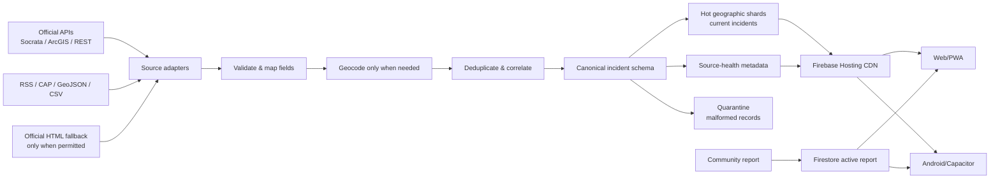
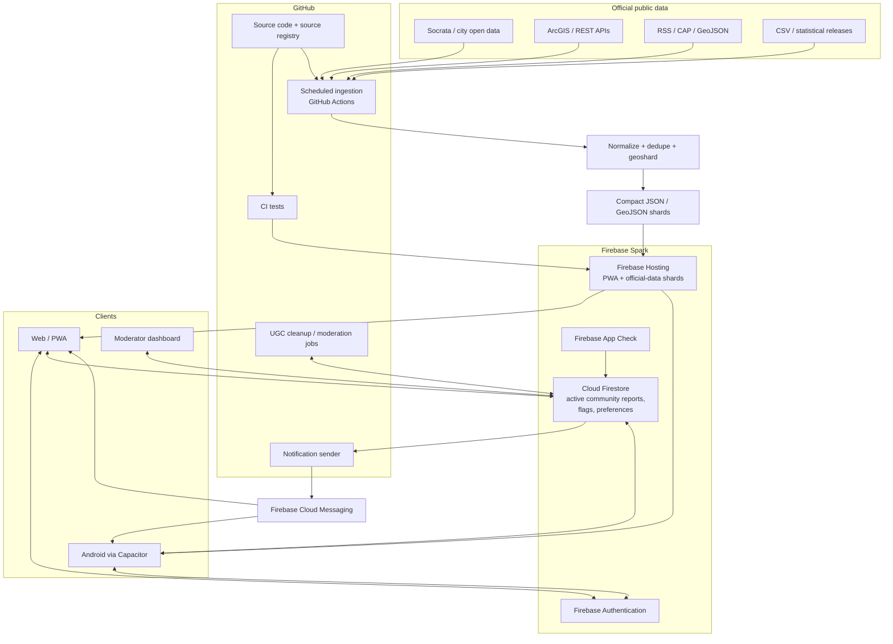
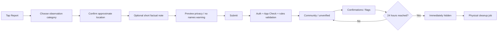

# Research and Architecture Plan for a Worldwide Local Public-Safety Incident App

## Executive summary

The product is feasible as an **Android + web application that combines authoritative public-safety data with clearly separated community reports**, but there is an important architectural reality: **there is no single free worldwide API for live police, fire, EMS, and 911/CAD incidents**. The strongest incident-level sources are local—city police/fire open-data portals, CAD dashboards, Socrata datasets, ArcGIS services, RSS/CAP feeds—while national sources such as the FBI Crime Data Explorer, UNODC, French Interior Ministry statistics, and Australian crime-statistics agencies are primarily delayed or statistical rather than live dispatch feeds. citeturn2search0turn22search0turn8search22turn10search1

The application therefore should not try to make user reports compensate for missing official coverage. Instead, every displayed item should belong to an explicit provenance class:

| Class | Meaning | Product treatment |
|---|---|---|
| **Official live/near-live** | CAD, dispatch, 911 calls, fire calls, official alerts | Highest-authority operational layer |
| **Official delayed** | Daily/weekly/monthly reported crime datasets | Clearly show source delay and data date |
| **Official statistical** | FBI/UNODC/national historical crime statistics | Context/analytics layer, not "happening now" |
| **Community** | User-submitted observation | Always visibly labeled community/unverified or community-confirmed; expires after 24 hours |

This distinction is essential. Chicago's crime dataset, for example, excludes the most recent seven days even though it updates frequently, whereas San Francisco has a law-enforcement dispatch dataset covering a rolling 48-hour window and refreshed about every ten minutes; Seattle's real-time fire dataset is updated every five minutes. These datasets should never appear in the UI as though they have the same latency. citeturn4search0turn4search6turn2search2

For the **strict Firebase Spark requirement**, the recommended MVP architecture is:

**React + TypeScript PWA → Capacitor Android app → Firebase Hosting → Firebase Authentication + Firestore for community reports → Firebase App Check → GitHub Actions as the no-billing ingestion/scheduler → compact official-data GeoJSON/JSON shards published to Firebase Hosting.**

This is deliberately serverless from Firebase's perspective. Cloud Functions cannot be deployed without upgrading the project to Blaze, and, importantly as of February 3, 2026, **Cloud Storage for Firebase also requires Blaze**. Firestore itself remains usable on Spark, but its free allowance is only 1 GiB stored, 50,000 reads/day, 20,000 writes/day, and 20,000 deletes/day; Firestore TTL deletes also require billing. citeturn16search2turn16search5turn17search0turn15search0

That means the correct Spark design is **not** to copy worldwide crime history into Firestore. Firestore should primarily hold small, dynamic application data such as active community reports, flags, user preferences, and possibly a small amount of source-health metadata. Official bulk data should be normalized by GitHub Actions into geographically sharded static snapshots and served through Firebase Hosting's CDN. Firebase's documentation gives Hosting 10 GB of storage; its official pages currently express free transfer as either approximately 10 GB/month or 360 MB/day depending on the page, so the product should engineer against the more conservative daily allowance. citeturn15search1turn17search1

GitHub Actions works well as the initial ingestion engine because standard runners are free for public repositories and scheduled workflows can run as often as every five minutes. It must **not** be treated as guaranteed real-time infrastructure: GitHub explicitly warns that scheduled jobs can be delayed or even dropped during periods of high load, and schedules on inactive public repositories are disabled after 60 days without repository activity. citeturn20view0turn20view1turn20view3

For community content, I recommend a hard product rule:

> **A community report is publicly eligible for exactly 24 hours from its original creation time. Edits, confirmations, or matching reports never extend that timer.**

Because Firestore TTL deletes require billing, enforce the rule with an immutable `expiresAt = createdAt + 24h`, filter expired reports at query/display time, reject attempts to extend `expiresAt`, and use an hourly GitHub Actions cleanup task for physical deletion. citeturn15search0

The app should launch without community photo/video uploads. Cloud Storage is unavailable on Spark, and media dramatically increases moderation, privacy, bandwidth, copyright, and evidentiary problems. Text, category, approximate location, timestamp, optional short note, confirmations, and flags are enough for a defensible MVP. citeturn17search0

Finally, this application must be positioned as an **information/awareness product, not an emergency-dispatch system or authoritative neighborhood-safety score**. Public feeds can be incomplete, delayed, redacted, shifted spatially, or voluntarily reported. Vancouver Police, for example, explicitly offsets crime locations and cautions against simplistic conclusions from the data. citeturn7search8turn7search3


## Public-safety data landscape

A worldwide system should treat data-source discovery as an expandable registry rather than a fixed list. Socrata alone hosts more than one hundred government and NGO catalogs and provides a programmatic Discovery API; Data.gov exposes a catalog API over a huge U.S. government dataset index. These are excellent **source-discovery mechanisms**, but each underlying police/fire/EMS dataset still needs its own cadence, schema, license, privacy, and geographic review. citeturn22search4turn3search2turn8search4

I would classify sources as **A = operational/near-real-time**, **B = recent batch**, **C = statistical/context**, and **R = restricted/not suitable as an open ingestion source**.

### Global and national sources

| Source and URL | Role / geographic coverage | Format | Update cadence | Access limits | License / reuse assessment |
|---|---|---|---|---|---|
| **GDACS — [Global Disaster Alert and Coordination System](https://gdacs.org/feed_reference.aspx)** | **A.** Worldwide earthquakes, floods, tropical cyclones, volcanoes, droughts/wildfires and other major sudden-onset disasters. Not police/EMS, but valuable worldwide hazard coverage. | Official API plus GeoJSON, JSON, KML, CAP XML and RSS feeds. The public feed directory exposes all of these formats. citeturn25search9turn25search19 | Popular feeds are documented as updated every six minutes. citeturn25search16 | API supports paging; event-list endpoint returns first 100 records by default. citeturn25search19 | GDACS/UN-European Commission terms should be checked before redistribution; preserve attribution and source URLs rather than assuming a generic open-data license. |
| **NASA FIRMS — [Fire Information for Resource Management System](https://firms.modaps.eosdis.nasa.gov/)** | **A.** Global satellite-detected active fires and thermal anomalies. Useful for wildfires; it is not a replacement for municipal structure-fire dispatch. | SHP, KML, TXT and WMS/web services are published by FIRMS. citeturn25search0 | Global detections are generally available within three hours of satellite observation; some U.S./Canadian detections are available in real time. citeturn25search0turn25search3 | Endpoint-specific; design an adapter rather than bulk-hammering download services. | NASA/Earthdata reuse and attribution terms should be recorded in the source registry. |
| **UNODC — [UNODC Data Portal](https://dataunodc.un.org/)** | **C.** International crime/criminal-justice statistics. Excellent country comparison and coverage metadata; unsuitable as a live incident feed. | Statistical portal/downloads. | Periodic national submissions rather than live incidents. | Dataset-dependent. | UN terms apply; retain dataset/source attribution. UNODC cautions that crime figures often reflect crimes recorded or detected by authorities, which matters when comparing countries. citeturn8search22 |
| **FBI Crime Data Explorer — [cde.ucr.cjis.gov](https://cde.ucr.cjis.gov/)** | **C/B.** United States, participating federal/state/local/tribal/college agencies; NIBRS and Summary Reporting System data. Useful for verified historical/local crime context, not immediate alerts. | API/read-only data services, downloadable CSV and visualization exports. citeturn2search0turn9search20turn2search4 | UCR data are released on a recurring/monthly basis, but local agency participation and reporting timeliness vary. citeturn2search12turn6search23 | Read-only; use API/download mechanisms and cache. | Public U.S. government crime data; preserve FBI/UCR provenance and review the particular download/API terms before redistribution. |
| **Data.gov — [data.gov](https://data.gov/)** | **Discovery.** U.S. federal/state/local catalog. Useful for discovering fire, EMS, dispatch and police datasets but not itself a unified incident API. | CKAN catalog API; underlying resources may be CSV, JSON, GeoJSON, ArcGIS, etc. citeturn3search2turn9search28 | Per underlying dataset. | Catalog API plus individual provider limits. | License is dataset-specific; do not infer that every result has identical reuse rights. |
| **Police.uk Open Data — [data.police.uk](https://data.police.uk/)** | **B.** England, Wales and Northern Ireland; street crime, outcomes, stop/search, police-force and neighborhood information. | CSV bulk downloads and JSON web API. citeturn22search0turn9search14 | Police forces provide data monthly. citeturn22search0 | No reliable universal numeric limit should be hard-coded; cache and handle HTTP throttling/errors. | Explicit **Open Government Licence v3.0**. citeturn22search0turn2search21 |
| **France Ministry of the Interior / SSMSI — [Interstats](https://www.interieur.gouv.fr/Interstats) and [data.gouv.fr](https://www.data.gouv.fr/)** | **C/B.** France; police/gendarmerie recorded-crime statistical databases, including municipality/department-level material. | Data.gouv resources commonly expose machine-readable tables/downloads; exact format varies by release. | Mainly periodic/statistical rather than live dispatch; SSMSI publishes recorded-crime statistical series from 2016 onward. citeturn10search1turn10search0 | Dataset-specific. | French government datasets commonly identify their Etalab/Open Licence terms on the dataset record; record the exact license rather than applying one blindly to the entire portal. citeturn10search4 |
| **NSW Bureau of Crime Statistics and Research — [BOCSAR](https://bocsar.nsw.gov.au/)** | **B/C.** New South Wales, Australia; offense, court, custody and incident statistics. | Downloadable open datasets/tables. | Mix of daily/quarterly/annual products depending on dataset; quarterly reporting is prominent. citeturn9search0turn9search12 | Download-based; dataset dependent. | NSW dataset terms/metadata should be stored per connector. |
| **Victoria Crime Statistics Agency — [crimestatistics.vic.gov.au](https://www.crimestatistics.vic.gov.au/)** | **B/C.** Victoria, Australia. | Downloadable tables, including spreadsheet resources. citeturn9search1turn9search9 | Periodic statistical releases, not dispatch data. | Normal download access. | Record the license shown with each released dataset. |
| **Queensland Police — [Maps and Statistics](https://www.police.qld.gov.au/maps-and-statistics)** | **B.** Queensland crime locations/statistics; useful local crime layer. | QPS map/API resources. | The online crime map provides approximately the preceding five years of crime-location data; it is not a live CAD feed. citeturn9search2turn9search6turn9search10 | Endpoint-specific. | Queensland open-data/provider terms should be reviewed per API/resource. |
| **Australian Bureau of Statistics — [Recorded Crime — Victims](https://www.abs.gov.au/statistics/people/crime-and-justice/recorded-crime-victims/latest-release)** | **C.** Australia-wide annual official crime statistics. | CSV/XLSX-style statistical downloads. | Annual; for example, 2025 Recorded Crime — Victims was released in September 2026. citeturn9search8 | Download/statistical API mechanisms. | ABS attribution/copyright terms apply. |
| **New Zealand official crime/statistics ecosystem — [data.govt.nz](https://www.data.govt.nz/)** | **C/B.** New Zealand police/crime statistical resources. | Official tools allow downloadable tabular output such as CSV/Excel where provided. | Periodic rather than CAD/live nationwide incident streaming. citeturn9search11turn9search15 | Dataset-specific. | New Zealand government dataset license specified on the particular record. |

The national rows above are valuable for credibility and context, but only a subset should power "what is happening near me right now." **Do not turn monthly NIBRS, Police.uk, French crime statistics or annual ABS figures into red "live incident" markers.** Their data semantics do not support that interpretation. citeturn6search23turn22search0turn10search1turn9search8

### High-value major-city feeds

| Source and URL | Data and coverage | Format | Freshness | Access / licensing |
|---|---|---|---|---|
| **Seattle Fire — [Real-Time Fire 911 Calls](https://data.seattle.gov/Public-Safety/Seattle-Real-Time-Fire-911-Calls/kzjm-xkqj) / [live page](https://web.seattle.gov/sfd/realtime911/)** | Fire/EMS-related Seattle Fire dispatches. | Socrata JSON/CSV/GeoJSON plus city live web feed. | Open-data dataset updates about every five minutes; the Fire Department live page refreshes approximately every minute. citeturn2search2turn2search6turn2search10 | Very strong MVP source. Apply Seattle dataset/open-data terms; Socrata app token recommended for production polling. |
| **Seattle Police 911 response dashboard** | Police responses to 911 in Seattle; dashboard includes calls within a recent 24-hour window. citeturn2search14 | ArcGIS/dashboard; consume the official backing feature service if publicly exposed rather than scraping rendered map HTML. | Rolling/recent operational view. | Confirm exact ArcGIS endpoint and Seattle reuse terms during connector onboarding. |
| **NYC NYPD Calls for Service YTD — [NYC Open Data](https://data.cityofnewyork.us/browse?q=NYPD%20Calls%20for%20Service)** | Entries generated by NYPD's 911/ICAD calls-for-service system. citeturn5search0 | Socrata SODA: JSON/CSV/GeoJSON. | Year-to-date operational dataset; use the dataset metadata's current update timestamp rather than assuming a hard real-time SLA. | NYC Open Data is publicly available, but preserve the dataset's stated terms and disclaimers. citeturn2search19 |
| **NYC NYPD Complaint Data Current YTD — [NYC Open Data](https://data.cityofnewyork.us/browse?q=NYPD%20Complaint%20Data%20Current)** | Reported felony, misdemeanor and violation complaints. citeturn2search3 | Socrata API/downloads. citeturn2search11 | Batch/YTD rather than live 911. | Use as verified crime layer separate from calls-for-service. |
| **Chicago Crimes — [2001 to Present](https://data.cityofchicago.org/Public-Safety/Crimes-2001-to-Present/ijzp-q8t2)** | Chicago Police reported crimes. | Socrata JSON/CSV/GeoJSON. | Updated daily Tuesday–Sunday, but explicitly excludes the most recent seven days. citeturn4search0 | Excellent historical/recent layer; not a live incident source. Check City of Chicago dataset terms. |
| **San Francisco Law Enforcement Dispatched Calls — [DataSF search](https://data.sfgov.org/browse?q=Law%20Enforcement%20Dispatched%20Calls%20for%20Service%20Real-Time)** | Police-dispatch activity. | DataSF/Socrata JSON, CSV, GeoJSON. | Real-time dataset contains a rolling 48-hour period and updates about every ten minutes. citeturn4search6 | One of the strongest public police-dispatch sources for an MVP. Preserve DataSF licensing metadata. |
| **San Francisco closed law-enforcement calls** | Completed dispatch history. | DataSF/Socrata. | Updated about every 24 hours. citeturn4search2 | Useful for reconciliation after live incidents close. |
| **San Francisco Fire Calls for Service — [DataSF](https://data.sfgov.org/browse?q=Fire%20Calls%20for%20Service)** | Fire Department calls with incident/call/unit/call-type information. citeturn4search4 | DataSF/Socrata machine-readable API/download. | Dataset metadata determines current cadence. | Strong official fire/EMS-style source; avoid exposing sensitive fields merely because they are technically present. |
| **Toronto Paramedic Services Incident Data — [Toronto Open Data](https://open.toronto.ca/dataset/paramedic-services-incident-data/)** | Paramedic responses with generalized incident type/priority data. citeturn7search1 | Toronto Open Data downloadable resources/API where exposed. | Dataset release cadence; treat as batch unless its metadata explicitly states otherwise. | Excellent official EMS source. Toronto Open Data license/metadata controls reuse. citeturn7search5 |
| **Toronto Police Calls for Service — [TPS Open Data](https://data.tps.ca/)** | Police calls attended; some records/categories are excluded for privacy. citeturn7search2turn7search4 | ArcGIS/open-data resources. | Portal-dependent. | Treat omitted/redacted data as intentional; do not attempt to reconstruct it. |
| **Vancouver Police GeoDASH — [Open Data](https://geodash.vpd.ca/opendata/)** | Mapped Vancouver crime records. | Downloadable geographic/open data. | Updated each Sunday morning. citeturn7search8 | Locations are intentionally offset/generalized; VPD itself warns about using these data to draw simplistic conclusions about safety. Preserve that limitation. citeturn7search8turn7search3 |

### Portal technologies worth building generic connectors for

A relatively small number of adapter types unlock a large number of local jurisdictions.

**Socrata SODA** should be a first-class adapter. Socrata supports JSON, GeoJSON and CSV, provides `ETag` and `Last-Modified` response headers useful for efficient polling, returns `429` when throttled, and recommends application tokens. Current Socrata documentation says tokenized requests get their own request pool and ordinarily are not throttled unless abusive; unauthenticated requests share IP-based throttling. API versions differ in paging limits: version 2.0 has a maximum `$limit` of 50,000, while newer 2.1/3.0 endpoints do not impose that same fixed maximum, though enormous responses remain a bad idea. citeturn22search1turn22search2turn22search3

**ArcGIS FeatureServer/MapServer** should be another generic adapter. Many police open-data dashboards are simply front ends over public ArcGIS feature services. The connector should consume the documented underlying service when available—not scrape map pixels or browser-generated HTML.

**CKAN** should power discovery/catalog ingestion. Data.gov is a major example, while many national/local open-data portals expose CKAN-style catalogs. citeturn3search2

**RSS/CAP/XML/GeoJSON** adapters will cover disaster and public-alert systems such as GDACS, which publishes feeds at six-minute intervals. citeturn25search16turn25search9

### Waze is not an open incident feed

Waze deserves a specific exclusion rule. **Waze for Cities is a partner program**, oriented toward approved government/public authorities, traffic operators and similar organizations. Waze's partner feed specifications describe XML/JSON feeds used by partners to exchange traffic/closure information; they are not a blanket public license to scrape Waze Live Map and republish user-generated reports in another commercial or public-safety application. citeturn12search0turn12search1turn12search3

Therefore:

**Do not scrape Waze. Do not build the product around Waze data.** Add a source only if Waze explicitly approves the project and grants terms allowing the intended downstream use.

A similar rule should apply to scanner-streaming sites and proprietary "crime map" products: absence of authentication is not the same thing as permission to republish.


## Ingestion, normalization and data-quality strategy

The ingestion system should be built as a set of independent adapters feeding one canonical representation. This lets the application add cities without changing the clients.



**Polling strategy.** Poll according to what the upstream data can actually provide rather than using one global interval. A Seattle Fire-style five-minute feed can be checked every five minutes; San Francisco's ten-minute dispatch dataset every ten minutes; daily datasets once or twice daily; Police.uk monthly; annual statistical releases only when a new release is expected. Seattle and San Francisco demonstrate why cadence belongs in source configuration rather than application code. citeturn2search2turn4search6turn22search0

On GitHub Actions, five minutes is also the minimum scheduled interval, and scheduled runs can be delayed. Therefore a nominal five-minute source may realistically have additional ingestion latency. Show `sourceUpdatedAt` and `ingestedAt` in the app instead of advertising an unsupported "real time" guarantee. citeturn20view0turn20view2

A suggested schedule matrix is:

| Source type | Poll cadence | Retained client-facing window |
|---|---:|---:|
| 1–5 minute CAD/fire feed | 5 minutes | 24–48 hours |
| 10–15 minute dispatch feed | 10–15 minutes | 24–48 hours |
| GDACS/hazard feed | 5–10 minutes | Active + recent events |
| Daily crime feed | Daily after expected publication time | 30–90 days, geographically sharded |
| Weekly crime feed | Weekly + verification retry | 30–90 days |
| Monthly/annual statistics | Once around release + manual check | Context/analytics only |

**Conditional requests matter.** For Socrata and other HTTP sources, use `ETag`/`If-None-Match` and `Last-Modified`/`If-Modified-Since` whenever supported so a poll that has not changed returns almost no payload. Socrata exposes both validators. citeturn22search3

**Webhooks should be supported by the adapter interface but not assumed.** Most government open-data sources are designed for polling/downloads. When an official agency genuinely offers a signed webhook, it can later be routed through an external free backend; strict Firebase Spark itself provides no Cloud Functions endpoint. citeturn16search2turn16search5

**Scraping is the final fallback.** The order should be API → official download → RSS/CAP → official underlying ArcGIS/Socrata service → HTML extraction. Only enable an HTML adapter after verifying provider terms and robots/access expectations. HTML adapters should have low polling frequency, fixture tests, and a kill switch because a harmless page redesign can otherwise inject bad incident data.

**Never infer missing fields aggressively.** A missing category is `unknown`; it is not a license to classify a vague call as "shooting." A source-provided dispatch description should be mapped to a conservative taxonomy while preserving the original source label.

### Geocoding

Coordinates supplied by the official source are preferable to geocoding addresses. When only an address exists, normalize it and cache the result permanently or for as long as the source/license allows.

The public OpenStreetMap Nominatim service is unsuitable as a backend bulk geocoder: its public-use policy caps heavy use around one request per second, discourages systematic/bulk queries, and prohibits certain patterns such as client-side autocomplete on the public service. A production worldwide ingestion system should use jurisdiction-provided coordinates, a locally hosted geocoder, or a provider with terms explicitly permitting batch use. citeturn14view2

Store a `locationPrecisionMeters`/`locationMethod` field. A coordinate from a CAD system, a geocoded street address, and an intentionally shifted crime point are fundamentally different measurements.

### Deduplication and event correlation

Deduplication should be conservative and retain all provenance. The sequence should be:

1. Exact source ID: `{sourceId}:{sourceIncidentId}`.
2. Exact provider URL/event ID.
3. A spatiotemporal fingerprint based on normalized category + coarse geohash + configurable time bucket.
4. Optional fuzzy correlation when two official feeds plausibly describe the same event.

A good candidate fingerprint is approximately:

```text
SHA256(
  canonicalCategory +
  geohash(location, precision=6) +
  floor(occurredAt / 10_minutes)
)
```

Do **not** silently delete one incident merely because two events occurred near each other. Instead create a correlation group:

```text
correlationGroupId
  ├── Seattle Fire source record
  ├── police dispatch source record
  └── community observation
```

The UI can then show one combined card with several provenance badges while the database preserves every source record.

### Canonical data schema

The schema should make authority, timing, accuracy and licensing impossible to lose during normalization.

```json
{
  "id": "inc_01J...",
  "schemaVersion": 1,

  "category": "fire",
  "subcategory": "structure_fire",
  "title": "Structure fire response",
  "description": null,

  "status": "active",
  "severity": null,

  "occurredAt": "2026-09-16T18:13:00Z",
  "receivedAt": "2026-09-16T18:15:12Z",
  "sourceUpdatedAt": "2026-09-16T18:15:00Z",
  "ingestedAt": "2026-09-16T18:16:04Z",
  "expiresAt": null,

  "location": {
    "lat": 47.6123,
    "lon": -122.3311,
    "geohash": "c23nb...",
    "precisionMeters": 100,
    "method": "source_coordinate",
    "displayAddress": "100 block of Example St",
    "jurisdiction": {
      "country": "US",
      "region": "WA",
      "locality": "Seattle"
    }
  },

  "source": {
    "id": "seattle_fire_realtime",
    "kind": "official",
    "agency": "Seattle Fire Department",
    "incidentId": "provider-id",
    "url": "https://...",
    "format": "socrata",
    "licenseId": "source-specific-license"
  },

  "verification": {
    "state": "official",
    "communityConfirmations": 0,
    "communityFlags": 0
  },

  "correlationGroupId": null,
  "dedupeKey": "sha256:...",

  "provenance": [
    {
      "sourceId": "seattle_fire_realtime",
      "sourceIncidentId": "provider-id"
    }
  ]
}
```

Community reports use the same broad schema but have:

```json
{
  "source": {
    "kind": "community"
  },
  "verification": {
    "state": "community_unverified"
  },
  "createdAt": "2026-09-16T18:20:00Z",
  "expiresAt": "2026-09-17T18:20:00Z"
}
```

That `expiresAt` must be immutable.

### Source registry

Keep source behavior out of code wherever possible:

```yaml
id: sf_police_dispatch_realtime
jurisdiction: US-CA-San_Francisco
authority: official
type: police_dispatch

adapter: socrata
url: https://data.sfgov.org/...
format: json
poll_every_minutes: 10
lookback_minutes: 180
retention_hours: 48

license:
  name: verify-from-dataset-metadata
  attribution_required: true

mapping:
  source_id: incident_number
  occurred_at: call_date
  category: call_type
  latitude: latitude
  longitude: longitude

health:
  stale_after_minutes: 30
```

The registry also becomes the basis for a public **Sources & Limitations** page showing what areas are covered, last successful update, expected latency, and license.

### Error handling

Every connector should have a `lastAttemptAt`, `lastSuccessfulSyncAt`, `lastSourceModifiedAt`, record count, error code and consecutive-error counter. HTTP `429` should trigger exponential backoff with jitter; Socrata specifically documents `429` for throttling. citeturn22search1turn22search3

Use an overlap window on every incremental poll—for example, re-read the previous 30–60 minutes even if the last cursor says you are caught up—because government systems sometimes amend or backfill records.

Malformed records should go into a quarantine log instead of becoming map points with default coordinates. A source should automatically be marked `degraded` if its record count changes implausibly or its schema suddenly loses required fields.

The client should keep the most recent valid snapshot and show:

> "Official feed last updated 42 minutes ago — source may be delayed."

rather than replacing the map with nothing.


## Firebase Spark architecture and hosting tradeoffs

The most important 2026 Firebase constraints are stricter than many older tutorials imply.

Cloud Functions for Firebase requires Blaze to deploy. Cloud Storage for Firebase now also requires Blaze: after February 3, 2026, Spark projects cannot access Firebase Storage buckets. Firestore remains available with a free quota, and classic Firebase Hosting remains available on Spark. citeturn16search8turn17search0turn15search0

Do not confuse **Firebase Hosting** with newer **Firebase App Hosting**. For this project, use the classic static Hosting product that works naturally with a React/Vite build and Spark's no-cost limits. Firebase's Spark pricing explicitly requires no payment method. citeturn17search1

### Recommended architecture



This architecture intentionally separates **bulk official information** from **small mutable user data**.

### Firebase product decision table

| Product | Spark status in September 2026 | Relevant no-cost limits | Recommendation |
|---|---|---|---|
| **Firebase Hosting** | Available | 10 GB storage. Official Firebase pages currently express free transfer as roughly 10 GB/month or 360 MB/day; design for the tighter constraint. citeturn15search1turn17search1 | **Use.** Host SPA/PWA plus compressed geographic incident shards. |
| **Cloud Firestore** | Available | 1 GiB storage; 50k reads/day; 20k writes/day; 20k deletes/day; 10 GiB/month outbound. citeturn15search0 | **Use selectively.** Community reports, moderation, preferences, not the worldwide raw-data lake. |
| **Realtime Database** | Available | Spark pricing lists 1 GB stored, 100 simultaneous connections and about 10 GB/month/360 MB/day download. citeturn17search1 | Possible but not preferred. Firestore's document/query model fits reports/moderation better. |
| **Cloud Storage for Firebase** | **Unavailable on Spark** | Blaze is required to access buckets as of February 3, 2026. citeturn17search0turn17search3 | **Do not use.** Therefore no user photo/video upload in strict Spark MVP. |
| **Cloud Functions** | **Unavailable for production deployment on Spark** | Functions require Blaze. citeturn16search2turn16search5 | **Do not use.** GitHub Actions handles scheduled trusted work. |
| **Firebase Auth** | Available | Spark now limits most email/social/anonymous/custom sign-in providers to 3,000 DAU. citeturn16search3 | Use anonymous browsing/sign-in plus optional account upgrade. Watch DAU ceiling. |
| **App Check** | Available | Play Integrity has a 10,000-call/day standard quota; reCAPTCHA Enterprise has 10,000 free assessments/month according to Firebase docs. citeturn16search1 | **Use.** Significant spam barrier, though not a substitute for rate limiting. |
| **FCM** | Available | FCM supports Android and web; web requires HTTPS/service workers. citeturn15search3turn15search18 | Use for optional nearby alerts. Sending still needs trusted server credentials. |

Firestore's built-in TTL feature should **not** be the community-report expiration implementation on Spark because TTL deletes are among the features requiring billing. citeturn15search0

### Why static geographic shards are preferable to putting every official incident in Firestore

Suppose every map refresh reads 50 incident documents. Only 1,000 such map loads would consume Firestore's 50,000-read daily Spark quota. That is not much headroom for a public app. The official quota itself is 50,000 reads/day. citeturn15search0

Instead generate files such as:

```text
/data/v1/manifest.json
/data/v1/source-health.json

/data/v1/cells/dr5ru/current.json
/data/v1/cells/dr5rv/current.json
/data/v1/cells/dr5rw/current.json

/data/v1/cells/c23nb/current.json
...
```

Each cell contains only the currently relevant normalized official incidents. The web app requests cells intersecting the viewport and can cache them using ETags/service workers.

For large cities, add a second subdivision:

```text
/data/v1/cells/dr5ru/2026-09-16T1815.json
```

with a tiny `latest.json` pointer.

Do not mirror twenty years of Chicago records into Firebase. Query/transform the upstream dataset into the subset required by the user experience. Chicago itself retains the historical source. citeturn4search0

### GitHub as the ingestion engine

GitHub Actions is attractive because standard hosted runners are free for public repositories. Private GitHub Free repositories receive 2,000 included Actions minutes per month, whereas public repositories can use standard runners without minute charges. citeturn20view3

A scheduled workflow might run:

```yaml
on:
  schedule:
    - cron: "3/5 * * * *"
  workflow_dispatch:
```

GitHub currently permits schedules as frequently as every five minutes. Avoid exactly `:00`, because GitHub says the start of an hour is a high-load period where scheduled jobs may be delayed. Public-repository schedules are also automatically disabled after 60 days without repository activity. citeturn20view0turn20view1

That makes GitHub Actions excellent for an **MVP near-real-time aggregator**, but not an emergency-grade dispatch bus.

Use two workflow classes:

```text
ingest-fast.yml
  Seattle Fire
  SF dispatch
  GDACS
  other fast sources

ingest-batch.yml
  FBI
  police.uk
  Chicago
  national statistics
  weekly/monthly sources
```

Deploy only when output content hashes change.

A second Firebase Hosting target dedicated to `/data` can keep high-frequency feed releases logically separate from app releases. Configure Hosting release retention carefully because hundreds of deployments per day can otherwise create needless historical-release storage; Firebase explicitly recommends controlling the number of retained releases when managing Hosting storage. citeturn15search1

### Backend alternatives

| Architecture | Costs / free-tier position | Server code | Main advantage | Main problem |
|---|---|---|---|---|
| **Firebase Spark + GitHub Actions** | No-payment-method Firebase Spark; public standard GitHub Actions runners free. citeturn17search1turn20view3 | Scheduled only | Best fit for the stated constraints | Five-minute+ scheduling, no immediate request-time backend |
| **Firebase Hosting + Supabase Free backend** | Supabase currently advertises a Free tier with 500 MB database, 50k MAU, 5 GB egress, 5 GB cached egress and 1 GB file storage. citeturn21search1 | Database/API/Edge Functions available | SQL/PostGIS-style model is attractive for geographic incident queries; media storage possible | Adds another vendor and another set of quotas; verify current free-tier billing requirements before committing |
| **Firebase + RTDB instead of Firestore** | Inside Spark | Client-driven | Very simple realtime streaming | 100 simultaneous-connection Spark ceiling and weaker model for complex geographic/moderation queries. citeturn17search1 |
| **GitHub Pages as primary app host** | Soft 100 GB/month bandwidth and 1 GB site limit. citeturn20view4turn20view5 | None | Generous static bandwidth | GitHub explicitly says Pages is not intended as free hosting for a commercial SaaS product, so it is a poor production choice for this product. citeturn20view4 |
| **Cloudflare Workers/D1 candidate** | Cloudflare maintains free developer tiers across Workers/storage products, but exact quotas and account requirements change. citeturn21search0 | Yes | Better request-time APIs and schedulers than GitHub Actions | Introduces another platform; current free-tier limits should be revalidated immediately before adoption |

My recommendation is to **start with Firebase Spark + GitHub Actions** and deliberately define an architectural migration point. When the product hits Spark limits or needs true event-driven moderation/push, moving the ingestion/API layer to a real free/paid serverless backend can happen without rewriting the clients because the canonical schema stays the same.

### Authentication and offline operation

Allow the public map to be viewed without requiring an account where possible. Require Firebase authentication only for submissions, confirmations, flags, saved alert areas and moderation.

Anonymous Firebase Auth provides low-friction identity but counts against Spark's current 3,000-DAU limit for most providers, so that ceiling must be monitored. citeturn16search3

Firestore supports offline persistence on Android, Apple and web. Android persistence is enabled by default; web persistence is opt-in and supported on Chrome, Safari and Firefox. Firebase specifically warns that web caches persist between sessions, which matters if anything sensitive is ever stored client-side. citeturn15search2

For official static feeds, use a PWA service worker/Workbox cache and retain the last successfully loaded nearby cells with a visible timestamp.

### Notifications

FCM is a good fit for Android/web notifications, but messages must originate from a **trusted server environment**. Firebase's own documentation says the sender needs to securely hold authorization credentials and registration tokens; the HTTP v1 API uses OAuth access tokens/service-account authorization. Never put an FCM service-account credential in the Android app or JavaScript bundle. citeturn15search8turn15search12

Under the Spark/GitHub design:

```text
Official feed changes
      ↓
GitHub Actions ingestion
      ↓
new high-interest incident?
      ↓
query saved coarse alert zones
      ↓
FCM HTTP v1
      ↓
Android / web notification
```

The five-minute GitHub scheduling limitation means these are **nearby informational alerts**, not guaranteed emergency notifications. citeturn20view0turn20view2


## Community reports, trust, moderation and privacy

Community data should supplement official feeds without ever masquerading as law-enforcement information.

### Submission flow

A safe submission experience is:



Recommended initial categories are:

`fire/smoke`, `medical response`, `police activity`, `vehicle crash`, `road hazard`, `hazardous condition`, and `other public-safety activity`.

I would deliberately **not** offer categories such as "suspicious person," "criminal," "drug dealer," or "gang member." Those categories invite profiling, accusations and harassment rather than reporting observable public-safety conditions.

The report form should say something like:

> Report what you can directly observe. Do not identify suspects, patients, victims, private individuals, apartment numbers, phone numbers, license plates, or other personal information.

### Exact 24-hour staleness policy

The most robust semantics are:

```text
createdAt = trusted server/Firebase request time
expiresAt = createdAt + exactly 24 hours
```

Then enforce:

```text
confirmation does not extend expiresAt
editing does not extend expiresAt
moderator review does not extend expiresAt
matching an official event does not extend expiresAt
```

If an official source later confirms the underlying event, create or correlate a separate **official incident object**. The original user report still expires.

Because Spark cannot use Firestore TTL deletes without billing, expiration has two layers: citeturn15search0

**Visibility expiry:** every client query requires `expiresAt > now`; the UI additionally refuses to display stale objects.

**Physical cleanup:** a GitHub Action runs hourly and deletes expired community reports. The user-visible guarantee is still exactly 24 hours even if the actual document survives another few minutes before cleanup.

This is better than depending on a background deletion system whose timing may not equal the product's staleness contract.

### Spam control that works without Cloud Functions

App Check should be mandatory for writes. It can protect Firestore and Authentication, using Play Integrity on Android and reCAPTCHA mechanisms on web; Firebase notes that App Check reduces unauthorized-client abuse but does not eliminate every abuse vector. citeturn16search1turn16search7

Security Rules should enforce:

- authenticated user for report/confirmation/flag writes;
- fixed allowed category enum;
- maximum text length, for example 280–500 characters;
- no arbitrary HTML;
- timestamp close to `request.time`;
- `expiresAt` exactly one 24-hour window after creation and immutable thereafter;
- latitude/longitude in valid ranges;
- no arbitrary `verification=official`;
- users cannot alter confirmation/flag counts directly;
- one confirmation and one flag per account per report.

The strongest Spark-only anti-spam design is to put community reports into a **small fixed number of per-user active slots**.

Conceptually:

```text
/communityReportUsers/{uid}/slots/0
/communityReportUsers/{uid}/slots/1
/communityReportUsers/{uid}/slots/2
```

A slot can be created if empty, or replaced only after its previous report has expired. That gives each account a maximum of three simultaneously active reports without needing a server-side rate limiter. Collection-group queries can expose active slots geographically.

You can tune that to five slots later, but a hard active-report ceiling is substantially safer than allowing an anonymous authenticated device to create unlimited Firestore documents.

### Trust and verification

Do not publicly display a fake precision such as "87% true." Trust scores are useful internally but easy for users to misunderstand.

Public states should be categorical:

| Badge | Meaning |
|---|---|
| **Official** | Came directly from an identified official source |
| **Official + community activity** | Official event also has nearby community observations |
| **Community confirmed** | More than one independent community account reported/confirmed similar observable activity |
| **Community / unverified** | Single community observation |
| **Disputed** | Multiple flags or contradictory evidence |
| **Removed** | Moderation threshold reached |

An internal trust score can combine account age, prior confirmed reports, flag history, independent confirmations, App Check validity and proximity to an official event. **Only actual official-source provenance can produce the "Official" badge.**

This rule prevents a hundred users repeating a rumor from turning that rumor into "official crime."

### Confirmation mechanics

A confirmation should mean:

> "I also observe this activity."

not:

> "I believe this user's accusation."

Require a distinct authenticated UID, one confirmation per report, and ideally require the confirming user to be in the general area at that moment if they voluntarily grant foreground location.

Do not require continuous/background location. Google Play's current policy makes background location subject to heightened review and says developers should use the smallest necessary location scope where the experience can work without background access. citeturn25search2turn25search8

### Moderation and Google Play requirements

Because the product contains user-generated content, Google Play's UGC policy is directly relevant. Google requires effective ongoing moderation and in-app mechanisms for users to report objectionable UGC; its policy also calls for blocking objectionable users/content where appropriate. citeturn25search1turn25search11

The product therefore needs, from its first public Android release:

```text
Flag report
Hide this report
Hide reports from this contributor
Report abuse reason
Moderator review queue
Terms / community rules
Ability to suspend an abusive account
```

Suggested automated thresholds:

```text
1 flag:
    keep visible, add to moderation queue

2 independent high-confidence flags:
    reduce prominence

3+ independent flags:
    temporarily hide pending moderator review

obvious prohibited personal data:
    auto-hide as soon as detected
```

Those are product recommendations, not a legal safe harbor; thresholds should be tuned using real abuse patterns.

A small moderator web interface can live inside the Firebase-hosted SPA and use a `moderators/{uid}` allowlist checked by Firestore Security Rules. That avoids requiring Cloud Functions/custom-claim infrastructure for the MVP.

### Personal data and location privacy

A worldwide launch must assume that location + time + user identity can become personal data. GDPR applies broadly to controllers offering services to people in the EU or monitoring their behavior in the EU; the Regulation emphasizes identifiable-person data, minimization, retention controls and protection of personal information. citeturn24view1

The safest design is therefore to avoid collecting most of it:

**Do not store continuous user-location history.** Request foreground location to center the map/report position, convert it to the necessary coarse coordinates, and discard the raw precision unless absolutely required.

**Do not publicly expose a reporter's Firebase UID, email, precise device identifier or exact private residence.**

**Quantize community locations before upload.** For example, 50–150 m or a nearby intersection/block can be appropriate depending on density.

**Do not expose medical details from EMS data.** Show "EMS response" rather than descriptions that could identify a patient.

**Do not create permanent dossiers from community reports.** The public content expires at 24 hours.

A separate minimal abuse/audit record may need to survive longer—for example, report ID hash, internal user identifier, moderation action and reason—but that retention should have an explicit short policy and should not preserve the original public accusation indefinitely.

### Source licensing must be first-class data

Every adapter should have:

```json
{
  "license": {
    "name": "Open Government Licence v3.0",
    "url": "...",
    "attribution": "...",
    "redistributionAllowed": true,
    "derivativeConditions": "..."
  }
}
```

The application can then automatically generate its Sources/Attribution screen.

Police.uk explicitly uses OGL v3.0. citeturn22search0

OpenStreetMap data are under ODbL and require attribution, with share-alike implications for derivative databases. citeturn14view0

Waze data must remain excluded unless the project has explicit partner rights. citeturn12search0turn12search3

For city datasets whose licensing metadata is unclear, leave the adapter disabled in production until someone records the actual terms. **"Publicly visible" is not a license.**


## Android, web and map experience

For this particular product, I recommend **React + TypeScript + Vite/PWA + Capacitor for Android** rather than maintaining separate Kotlin and web applications initially.

The reason is architectural simplicity: virtually all of the product is map rendering, filters, Firebase access, source metadata, location search and report forms. One TypeScript client can run as the web PWA and inside an Android Capacitor shell. Android-specific capabilities—foreground geolocation, notification permissions, app links—can be exposed through Capacitor plugins.

If the Android application later needs very high-performance native map rendering, extensive background behavior or complex native widgets, the Android map layer can migrate to native MapLibre without changing the incident schema/backend.

### Recommended client stack

| Layer | Recommendation |
|---|---|
| Language | TypeScript |
| UI | React |
| Build | Vite |
| Android packaging | Capacitor |
| PWA/offline | Workbox/service worker |
| Map | **MapLibre GL JS** or Leaflet |
| Map data | OpenStreetMap-derived basemap via policy-compliant tile source |
| Auth/database | Firebase Web SDK |
| Data validation | Zod |
| Geospatial | `ngeohash` or equivalent; `@turf/*` for geometry |
| State/query | TanStack Query + lightweight local state |
| Tests | Vitest + Playwright |
| Formatting/linting | ESLint + Prettier |
| Android CI | Gradle through Capacitor project |
| Feed ingestion | Node.js/TypeScript in GitHub Actions |

MapLibre is an open mapping/rendering library that supports GeoJSON-based map layers, making it well suited to the normalized shards above. citeturn14view3

### OpenStreetMap caveat

OpenStreetMap **data** are open, but that does not mean the community's default tile servers are an unlimited free CDN. OSM's standard tile-service policy is best-effort, can block abusive applications, prohibits bulk/offline tile downloading, requires proper attribution/identification and specifies caching expectations. citeturn14view0turn14view1

So:

**MVP:** MapLibre/Leaflet + standard OSM tiles, only while traffic is small and fully compliant with policy.

**Production:** make the tile URL/provider swappable from day one and move to an OSM-compatible provider or self-hosted basemap when traffic justifies it.

Mapbox can be supported as an optional provider, but its commercial terms/free allowance can change and should not be part of the app's "entirely free public-data" assumption.

### Map interaction

The primary screen should open near the user's approximate foreground location and show a restrained set of markers.


[Download the SVG mockup](sandbox:/mnt/data/public_safety_map_mockup.svg)

The mockup intentionally differentiates official and community incidents rather than visually implying they have equal authority.

Recommended filters:

```text
Time:
  Last hour
  Last 6 hours
  Last 24 hours
  Recent official crime

Type:
  Police
  Fire
  EMS
  Crash
  Hazard
  Community

Authority:
  Official only
  Official + community
  Community only

Radius:
  1 mi / 2 km
  5 mi / 8 km
  10 mi / 16 km
  Map viewport
```

Each card should include three timestamps where relevant:

```text
Occurred: 2:14 PM
Official source updated: 2:20 PM
App received: 2:23 PM
```

That makes source latency visible.

### Avoid the "crime heatmap = unsafe neighborhood" trap

A pure red heatmap is easy to build and often misleading. Different agencies report differently; some datasets intentionally obscure locations; some represent calls, others confirmed reports, and others arrests or complaints. Vancouver's official documentation explicitly highlights spatial displacement and limitations in interpreting its crime data. citeturn7search8turn7search3

Use heatmaps only when:

- the user intentionally selects a historical statistical layer;
- data type and date range are shown;
- source coverage is reasonably complete;
- the UI explains that observed report density is not an objective measure of personal danger.

For the default nearby screen, markers/clusters are much more honest.

### Accessibility and safety UX

Every map marker should have an equivalent list item so the product remains usable without interacting with a map.

Do not rely exclusively on red/green status colors. Pair color with icons and labels such as `OFFICIAL`, `COMMUNITY`, `DELAYED SOURCE`, `EXPIRED`.

Prominently show:

> Public safety data may be delayed, incomplete, generalized, or incorrect. This app is not an emergency service.

For urgent situations, direct users to their **local emergency services** rather than globally hard-coding a single country's emergency number.

### Notification UX

Users should explicitly create alert areas such as:

```text
Home area: 1-mile radius
Work area: 2-mile radius
Current location while app is open
```

Do not continuously upload their GPS track.

Notifications should differentiate authority:

```text
OFFICIAL FIRE DISPATCH
Structure fire response reported 0.7 mi away
Source: Seattle Fire • updated 4 min ago
```

versus:

```text
COMMUNITY REPORT
Police activity reported nearby
Unverified • 2 community confirmations • 8 min ago
```

For web push, FCM requires HTTPS and a service worker; Firebase Hosting satisfies the HTTPS requirement. citeturn15search18

Set short message TTLs for transient alerts so a phone that has been offline all day does not suddenly notify the user about stale events. FCM lets Android/web senders set explicit message lifespans. citeturn15search14


## Implementation roadmap and deployment plan

A realistic first public MVP for one experienced full-stack developer is approximately **10–14 focused development weeks**, provided "worldwide" initially means a worldwide-capable adapter framework plus a curated set of strong launch jurisdictions—not hundreds of cities on day one. Integrating the worldwide long tail is an ongoing data-engineering program, not a one-time feature.

### Milestone plan

| Milestone | Estimated effort | Deliverable |
|---|---:|---|
| Product/schema foundation | 1 week | Repository, canonical schema, source registry, category taxonomy, provenance model |
| Web/PWA map shell | 1–2 weeks | Map, geolocation, filters, incident cards, static test feeds |
| Generic ingestion framework | 1–2 weeks | Socrata, JSON/GeoJSON, CSV, RSS/CAP adapters; caching; health metadata |
| Initial official integrations | 2–3 weeks | Seattle Fire, SF dispatch/fire, Chicago, NYC, Police.uk, GDACS, NASA FIRMS, FBI |
| Firebase community reporting | 1–2 weeks | Auth, App Check, Firestore rules, report slots, expiration, confirmations/flags |
| Moderator tooling | 1 week | Queue, hide/remove, abuse actions, source health panel |
| Android packaging | 1 week | Capacitor Android project, location permissions, FCM, deep links |
| Offline + notification work | 1 week | Cached nearby data and GitHub/FCM alert sender |
| Security/privacy/testing | 1–2 weeks | Rules tests, abuse testing, privacy controls, attribution page |
| Play Store/release hardening | 1 week | Store disclosures, UGC moderation flows, production monitoring |

A first engineering target should be **8–12 excellent official connectors**, not 100 mediocre scrapers.

Suggested launch sources:

```text
Seattle Fire
Seattle Police
San Francisco dispatch
San Francisco Fire
NYC Calls for Service
Chicago Crimes
Police.uk
FBI CDE
GDACS
NASA FIRMS
Toronto Paramedic
Vancouver GeoDASH
```

That mix exercises live fire, police calls, EMS, delayed crime, monthly national data, international hazards and several distinct portal types.

### Repository layout

```text
local-safety/
├── apps/
│   └── client/
│       ├── src/
│       ├── public/
│       ├── android/
│       └── vite.config.ts
│
├── packages/
│   ├── schema/
│   ├── geospatial/
│   └── source-registry/
│
├── ingestion/
│   ├── adapters/
│   │   ├── socrata.ts
│   │   ├── arcgis.ts
│   │   ├── geojson.ts
│   │   ├── csv.ts
│   │   ├── rss.ts
│   │   └── cap.ts
│   ├── sources/
│   ├── normalize/
│   ├── dedupe/
│   └── build-shards.ts
│
├── firebase/
│   ├── firestore.rules
│   └── firestore.indexes.json
│
├── tests/
│   └── fixtures/
│
└── .github/
    └── workflows/
        ├── test.yml
        ├── deploy-web.yml
        ├── ingest-fast.yml
        ├── ingest-batch.yml
        ├── cleanup-reports.yml
        └── send-alerts.yml
```

### CI/CD

Every pull request should:

```text
npm ci
npm run lint
npm run typecheck
npm test
npm run test:adapters
npm run test:firestore-rules
npm run build
```

Each source adapter should have saved fixture files. If San Francisco or Seattle changes a column name, CI should fail before malformed data reaches the map.

For scheduled ingestion:

```text
Fetch
→ validate response status/content-type
→ validate source schema
→ normalize
→ dedupe
→ compare with previous snapshot
→ build only changed geographic shards
→ run integrity checks
→ deploy changed feed target
→ record source health
→ optionally send FCM alerts
```

Never log Firebase service-account JSON, FCM tokens, emails, precise user locations or raw moderation content to public GitHub Actions logs.

### Firebase Spark setup

Create a regular Firebase project and keep it on Spark.

Enable:

```text
Firebase Hosting
Cloud Firestore
Firebase Authentication
Firebase App Check
Firebase Cloud Messaging
```

Do **not** enable an architecture that depends on:

```text
Cloud Functions
Cloud Storage for Firebase
Firestore TTL
```

because those violate the strict Spark/no-billing design in 2026. citeturn16search5turn17search0turn15search0

Typical local initialization:

```bash
npm install -g firebase-tools

firebase login
firebase init hosting
firebase init firestore

npm run build

firebase deploy \
  --only hosting,firestore:rules,firestore:indexes
```

Configure the Hosting SPA rewrite to `index.html`, set long immutable cache headers for hashed JavaScript assets and short/revalidation cache policies for current incident shards.

A production GitHub workflow should authenticate with a narrowly scoped Google/Firebase service identity kept in GitHub Secrets. Prefer short-lived/federated credentials when practical; if a long-lived JSON key is used initially, restrict its IAM permissions, rotate it, and never expose it to pull requests from forks.

### Example client-facing endpoints

The Spark/static architecture does not need a custom REST server for official incidents.

```http
GET /data/v1/manifest.json
```

Example:

```json
{
  "schemaVersion": 1,
  "generatedAt": "2026-09-16T18:20:00Z",
  "cells": {
    "dr5ru": {
      "url": "/data/v1/cells/dr5ru/current.json",
      "updatedAt": "2026-09-16T18:19:12Z"
    }
  }
}
```

```http
GET /data/v1/cells/{geohash}/current.json
GET /data/v1/source-health.json
GET /data/v1/sources.json
```

The client accesses community content through the Firestore SDK.

When the system eventually moves to a proper backend, preserve a conventional API contract:

```http
GET  /api/v1/incidents?bbox=-74.1,40.6,-73.8,40.9&since=2026-09-16T12:00:00Z
GET  /api/v1/incidents/{id}

POST /api/v1/reports
POST /api/v1/reports/{id}/confirm
POST /api/v1/reports/{id}/flags

GET  /api/v1/sources
GET  /api/v1/source-health
```

Example report request:

```json
{
  "category": "fire_smoke",
  "occurredAt": "2026-09-16T18:19:00Z",
  "location": {
    "lat": 42.652,
    "lon": -73.756,
    "accuracyMeters": 80
  },
  "note": "Heavy smoke visible behind nearby buildings."
}
```

Server-normalized response:

```json
{
  "id": "usr_01...",
  "verification": "community_unverified",
  "createdAt": "2026-09-16T18:20:02Z",
  "expiresAt": "2026-09-17T18:20:02Z"
}
```

### Scaling trigger

Spark should be regarded as the MVP envelope, not a promise that a globally popular app can remain entirely free forever.

Define explicit migration triggers such as:

```text
Firestore reads > 35,000/day repeatedly
Firestore writes > 12,000/day
Hosting transfer > 70% of free allowance
Auth > 2,000 DAU
GitHub scheduler delay becomes operationally unacceptable
active source count > roughly 50–100
moderation cannot be handled within 5-minute scheduled windows
```

At that point, move the ingestion/query backend to a platform designed for server-side workloads rather than distorting the product to stay beneath a free quota.


## Risk assessment and final recommendation

The largest risk is **not technical**. It is accidentally presenting incomplete or unverified information with more confidence than the underlying data deserves.

| Risk | Likelihood / impact | Mitigation |
|---|---|---|
| Official data coverage gaps | Very high / high | Coverage map, source-health screen, explicit "no official live source available" state |
| Data-source delay mistaken for current crime | High / high | Separate live dispatch, delayed official crime, and statistics in schema/UI |
| False community accusation | High / very high | Observable-event categories only, no suspect naming, 24h expiry, unverified badge, reporting/moderation |
| Doxxing or stalking | Medium / very high | Quantize community locations, no user identity display, no photo uploads initially, no passive GPS history |
| EMS privacy leakage | Medium / very high | Strip patient-identifying details regardless of what source happens to expose |
| Biased "unsafe neighborhood" conclusions | High / high | No simplistic safety score; source/context warnings; separate calls from confirmed crime |
| Feed schema changes | High / medium | Fixture tests, schema validation, quarantine and source circuit breaker |
| Scraper breaks | High / medium | Scraping last resort; official API/export first; kill switch |
| Upstream API rate limiting | Medium / medium | Conditional requests, source-aware polling, caching, backoff; Socrata app tokens. citeturn22search1turn22search3 |
| GitHub scheduler latency | Medium / high | Display ingestion timestamp; never advertise guaranteed realtime; later migrate fast sources to a true server backend. citeturn20view2 |
| Firebase quota exhaustion | Medium / high | Static official-data shards; reserve Firestore for dynamic UGC; quota dashboard |
| Spark feature incompatibility | Certain if ignored / high | No Functions, Cloud Storage or Firestore TTL. citeturn16search5turn17search0turn15search0 |
| UGC app-store rejection | Medium / high | In-app reporting, blocking and ongoing moderation as required by Google Play UGC policy. citeturn25search1 |
| Map-tile blocking | Medium / medium as traffic grows | Respect OSM tile policy and make provider configurable. citeturn14view1 |
| Geocoder blocking | High if bulk public Nominatim is abused | Cache, avoid bulk public Nominatim, switch/self-host at scale. citeturn14view2 |
| Licensing violation | Medium / very high | License registry and adapter allowlist; preserve attribution; block unknown/restricted sources |
| Waze terms problem | High if scraped / high | Do not ingest Waze absent explicit partnership/reuse authorization. citeturn12search0turn12search3 |
| Global privacy compliance | Medium / very high | Data minimization, short retention, foreground location, deletion controls, privacy-by-design review. citeturn24view1 |
| Service-account leak | Low–medium / very high | Least privilege, GitHub Secrets, no fork-secret exposure, rotation/federated auth |
| Users treat app as emergency service | Medium / very high | Persistent disclaimer; latency/source badges; direct users to local emergency services |

The product architecture I would actually build is therefore:

**One React/TypeScript codebase, packaged to Android with Capacitor and deployed to Firebase Hosting. MapLibre renders OSM-derived maps. GitHub Actions polls and normalizes approved official sources into small geographic JSON/GeoJSON shards. Firestore stores only active user reports, moderation state and preferences. Firebase Auth identifies contributors; App Check raises the cost of automated abuse; FCM handles opt-in alerts, sent by a trusted GitHub workflow. Community reports are visibly separate from official data and become invisible exactly 24 hours after creation, with no mechanism for confirmations or edits to prolong them.**

The most important engineering principle is to make **provenance as visible as the incident itself**. A Seattle Fire dispatch, a seven-day-delayed Chicago crime record, a monthly Police.uk record, a NASA satellite hotspot and a neighbor saying "I see smoke" are all useful pieces of information, but they are not interchangeable. Seattle's five-minute Fire 911 feed, San Francisco's ten-minute dispatch feed, Chicago's seven-day crime lag, Police.uk's monthly feed, NASA FIRMS' up-to-three-hour global satellite fire latency, and GDACS' six-minute disaster feeds illustrate just how different the underlying semantics are. citeturn2search2turn4search6turn4search0turn22search0turn25search0turn25search16

If that distinction is built into the schema, ingestion system, moderation rules and interface from the beginning, the app can expand city-by-city and country-by-country without becoming dependent on rumors, misleading crime maps, or one proprietary data provider.